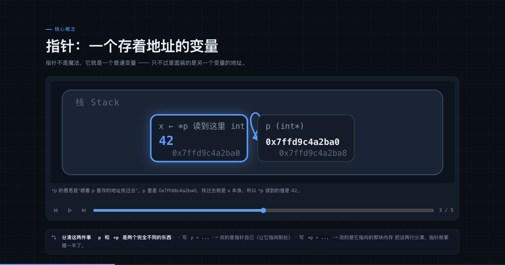
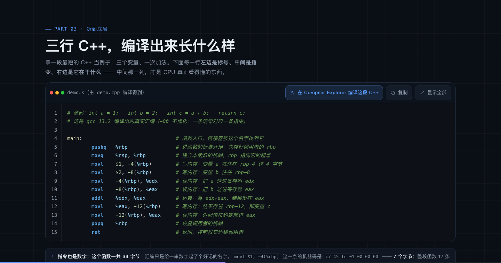

# C/C++ 程序设计教程（网页版）

由 8 份 PPT 课件整理而成的一套网页教程：**10 个部分、274 页，从数据类型一路讲到 Modern C++**。

**双击 `index.html` 就能看** —— 零构建、零依赖、不需要服务器、看完不需要联网。


它和"把 PPT 导出成图片"的区别在于两点：

- **内存可视化** —— 18 张可以逐步播放的内存图。栈/堆分区、变量盒子（名字-值-地址）、
  指针箭头，把"变量住在哪、指针指向谁、这一步改的是谁"一步步画出来，
  而不是用一段文字去描述。讲多态的那张会把**对象里的 vptr、虚函数表、函数地址**三层关系画全。
- **代码输出是真编译出来的** —— 页面上 100 段 C++ 的「程序输出」，
  全部由 clang++ 真机编译运行后回填，不是手写的预期值。

---

## 目录

| | 章节 | 页数 | 内容 |
|---|---|---:|---|
| 前言 | 课程介绍 | 21 | 计算机如何工作、程序为什么是指令序列、C 与 C++ 的关系、从源码到可执行文件 |
| 第 1 章 | 数据类型与变量常量 | 27 | 比特与字节、基本类型、变量的本质、常量、`sizeof`、类型转换、**字节序与 IEEE 754** |
| 第 2 章 | 运算符与表达式 | 26 | 算术/关系/逻辑/位运算、优先级与结合性、短路求值、副作用 |
| 第 3 章 | 控制流 | 31 | `if` 与 `switch`、三种循环、`break` 与 `continue` |
| 第 4 章 | 函数 | 24 | 定义与声明、值传递与引用传递、返回值、重载与默认参数、递归与调用栈 |
| 第 5 章 | 数组与字符串 | 23 | 一维/二维数组的内存布局、越界的危险、C 风格字符串与 `std::string` |
| 第 6 章 | 指针与函数 | 23 | 地址与解引用、指针算术、地址传递、野指针、`const` 指针、动态内存与引用 |
| 第 7 章 | 结构体、共用体与枚举 | 23 | 内存布局与填充、结构体指针、`typedef`/`using`、`enum class`、`union` |
| 第 8 章 | 类与多态 | 38 | 封装与不变式、对象的内存结构、构造析构与 RAII、继承、**虚函数表**、对象大小与对齐、四种类型转换 |
| 第 9 章 | Modern C++ 新特性 | 38 | C++11 讲透，C++14/17/20 概览 |

第 8、9 章是这一版**新增**的，原 PPT 里没有：

- **第 8 章「类与多态」** —— 原 PPT 讲完结构体就结束了，但"类"才是 C++ 的主体，
  而且第 9 章的智能指针、移动语义全都建立在构造析构之上。这一章把这条断掉的线补上，
  并用内存图讲清多态的实现原理：对象里的 `vptr` → 类专属的虚函数表 → 函数地址。
- **第 9 章「Modern C++」** —— `auto` 与范围 `for`、`lambda`、智能指针、移动语义、
  `std::thread` 与 `atomic`/内存序，再到 C++14/17/20 的重要更新。

前言里"三行 C++ 编译出来长什么样"一节也是新增的（含一段真实汇编的逐行注释）。

---

## 怎么打开

### 方式一：直接双击 `index.html`（推荐）

所有资源都是相对路径的普通 `<script>` / `<link>`，没有 ES 模块、没有 `fetch`，
因此 `file://` 协议下功能完整——已实测：无头 Chrome 打开 `file://` 下的 10 个章节，
控制台 0 错误。

### 方式二：起个本地服务器

```bash
python3 serve.py            # 默认 8000 端口，自动打开浏览器
python3 serve.py 8080       # 指定端口
python3 serve.py --offline  # 不自动打开浏览器
```

---

## 操作方式

| 操作 | 说明 |
|---|---|
| <kbd>←</kbd> <kbd>→</kbd> / <kbd>空格</kbd> | 上一页 / 下一页 |
| <kbd>PgUp</kbd> <kbd>PgDn</kbd> <kbd>Home</kbd> <kbd>End</kbd> | 翻页控制 |
| 触屏左右滑动 | 移动端翻页 |
| 点击左右边缘 | 桌面端翻页热区 |
| <kbd>O</kbd> | 总览（缩略网格，点击跳转） |
| <kbd>S</kbd> | 讲师讲解抽屉（来自 PPT 的演讲者备注） |
| <kbd>F</kbd> | 全屏，适合课堂投影 |
| <kbd>Esc</kbd> | 关闭总览 / 讲解 |

顶栏右侧可以切换明暗主题（默认跟随系统）与讲授/自学模式：

| | 课堂讲授 | 课后自学（默认） |
|---|---|---|
| 讲解文字 | 收进侧边抽屉 | 直接展开在页面上 |
| 字号 | 放大一档 | 常规 |
| 学习进度 | 不记录 | 记住学到哪一页 |

代码块右上角有三个按钮：**复制**、**显示全部**（跳过打字机动画，也可以直接点代码区域）、
**在 Compiler Explorer 打开**。

---

## 内存可视化



18 张内存图，每张都可以播放 / 单步 / 拖进度条：

| 位置 | 讲什么 |
|---|---|
| 1-6 | 内存：一连串带编号的格子 |
| 4-9 | 值传递与引用传递，到底差在哪 |
| 4-16 | 递归的调用栈：一层层压入，再一层层返回 |
| 5-7 | 数组在内存里是连续的 |
| 5-12 | 二维数组在内存里其实是一维的 |
| 6-6 | 指针：一个存着地址的变量 |
| 6-9 | 指针 `+1` 到底加了几个字节 |
| 6-12 | 值传递 vs 地址传递 |
| 6-15 | 野指针是怎么产生的 |
| 6-18 | 内存泄漏是怎么发生的 |
| 1-23 | IEEE 754：浮点数的 32 位怎么切成三段 |
| 7-10 | 为什么这个结构体占 8 字节而不是 5 |
| 7-19 | 联合体：成员共享同一块内存 |
| 8-9 | 对象里存了什么：成员变量在对象里，成员函数不在 |
| 8-19 | 派生类对象里，基类那部分在最前面 |
| 8-25 | **多态的实现：vptr → 虚函数表 → 函数地址** |
| 8-32 | 4 字节是怎么变成 16 字节的（vptr 与填充） |
| 9-17 | 拷贝一个字符串，代价有多大 |

图里的地址是**某一次运行**的快照，写全了（`0x7ffd9c4a2ba0`，不用省略号）——
操作系统每次运行都会随机化栈的位置（ASLR），所以你自己跑出来的数字必然不同，
真正稳定的是**相对关系**：相邻的 `int` 差 4 字节、指针差 8 字节。

---

## 代码输出的可信度



C++ 有大量未定义行为、平台差异和隐式类型转换，凭直觉写的输出十有八九是错的。
所以本项目有一道质量闸：

```bash
node tools/verify_examples.mjs
```

它把每章数据里的代码片段抽出来，用 `clang++ -std=c++20` 真机编译并运行，
与页面上写的 `expectedOutput` 逐行比对（比对前会去掉行尾空白，
因为 `cout << x << " "` 的输出每行末尾会多个空格，肉眼看不出来）。

当前状态：**100 段代码全部通过，0 失败**（另有 2 处代码块不参与验证：一处是讲编译过程的
伪代码，一处是汇编）。

这道闸真的拦下过错误：`rand()` 的输出序列、`cout` 的求值顺序、
"上海自来水来自海上"按字节比并不是回文、打印 `&a` 得到的地址每次都不一样，
都是先写错、被它抓出来的。

---

## 为什么不能在浏览器里跑 C++

同一系列的 Python 版教程用 Pyodide 在页面里真跑 Python。C++ 没有这个条件：

| 方案 | 为什么不用 |
|---|---|
| JSCPP 之类的 JS 解释器 | 2021 年就停更，只支持 C++ 的一个子集，跑不了现代 C++ |
| 把 clang 编译成 WebAssembly | 体积数十 MB；且无法支持"改代码后重新编译"的完整流程 |
| 在线编译器 API | 需要联网，且把用户代码发到第三方服务 |

与其做一个跑不了真代码的"运行"按钮，不如**如实展示真实编译输出**，
再给一个通往真实编译环境的入口：每个代码块右上角的
「在 Compiler Explorer 打开」会把当前页的源码带过去（URL 里编码了完整源码），
在那边可以改代码、换编译器、看各种优化级别的汇编。

---

## 目录结构

```
web/
├── index.html              课程首页
├── chapter.html            章节页（?ch=N，十章共用一套引擎）
├── serve.py                本地预览服务器（可选）
├── README.md
├── docs/                   预览图
├── assets/
│   ├── css/
│   │   ├── tokens.css      设计令牌：配色、字号、明暗主题变量
│   │   ├── deck.css        幻灯片布局与翻页外壳
│   │   ├── code.css        代码块、高亮、内存图、终端
│   │   ├── anim.css        入场动画、打字机、知识地图
│   │   ├── responsive.css  窄屏重排
│   │   └── home.css        首页
│   ├── js/
│   │   ├── icons.js        内联 SVG 图标
│   │   ├── code.js         C++ 词法高亮 + 逐 token 揭示（含一个汇编高亮模式）
│   │   ├── memory.js       内存可视化：布局、SVG 绘制、播放器
│   │   ├── render.js       数据 → DOM 布局模板
│   │   ├── deck.js         翻页引擎（WAAPI 过渡、幻灯片虚拟化、路由）
│   │   ├── compiler.js     复制、跳过动画、Compiler Explorer 链接
│   │   ├── theme.js        明暗主题
│   │   ├── mode.js         双模式与学习进度
│   │   ├── home.js         首页逻辑
│   │   └── main.js         章节页启动流程
│   └── data/
│       ├── preface.js      前言
│       ├── ch1.js … ch9.js 各章内容
│       └── manifest.js     章节目录
└── tools/                  仅开发期使用，不随站点发布
    ├── extract_pptx.py     从 PPT 提取素材（正文、备注、代码）
    ├── verify_examples.mjs 真机编译运行所有代码片段，比对预期输出
    ├── qa.mjs              无头浏览器截图与错误检查
    ├── CONTENT-SPEC.md     内容编写规范（数据结构、内存图格式）
    ├── out/                 PPT 提取结果（生成物）
    └── qa-out/              QA 截图（生成物）
```

整站资源约 **600 KB**，无任何运行时依赖。

---

## 修改内容

### 改某一页的文字

编辑 `assets/data/chN.js`，找到对应页改字段即可。

### 加一页

在该章的数组里插入一个对象，`type` 可选：

`title` `map` `toc` `section` `cards` `split` `code` `compare` `memory` `end`

字段说明见 [tools/CONTENT-SPEC.md](tools/CONTENT-SPEC.md)。

### 改配色

颜色全部定义在 `assets/css/tokens.css`：深色在 `[data-theme="dark"]`、
浅色在 `[data-theme="light"]`，改一处即全局生效。

---

## 开发者：质量检查

改完内容后跑这几条：

```bash
node tools/verify_examples.mjs           # 编译并运行所有代码，比对预期输出
node tools/verify_examples.mjs ch6 ch7   # 只查指定章节
node tools/qa.mjs errors                 # 无头浏览器检查控制台错误
node tools/qa.mjs variants 6 6,12        # 截图：深/浅 × 桌面/手机
node tools/qa.mjs mem ch6 6 3            # 内存图：第 6 页走到第 3 步再截图
```

`verify_examples.mjs` 是本项目的质量闸——页面上写了「输出：xxx」，
就必须是编译器真的跑出来的 xxx。
